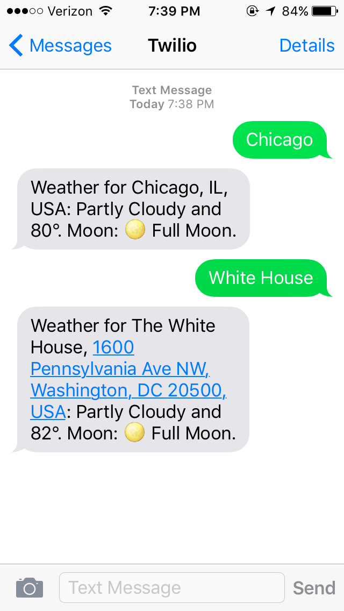

# SMS Weather

**SMS Weather** allows someone to send a text message of a location to a phone number and to receive the location's weather forecast.

- [Code repository](https://github.com/richardcornish/smsweather)
- [Deployed app](https://smsweather.herokuapp.com/)

